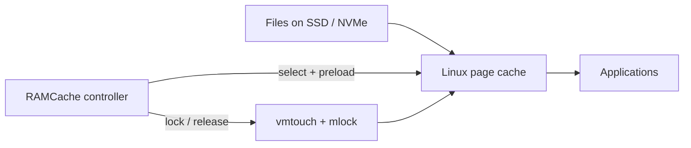
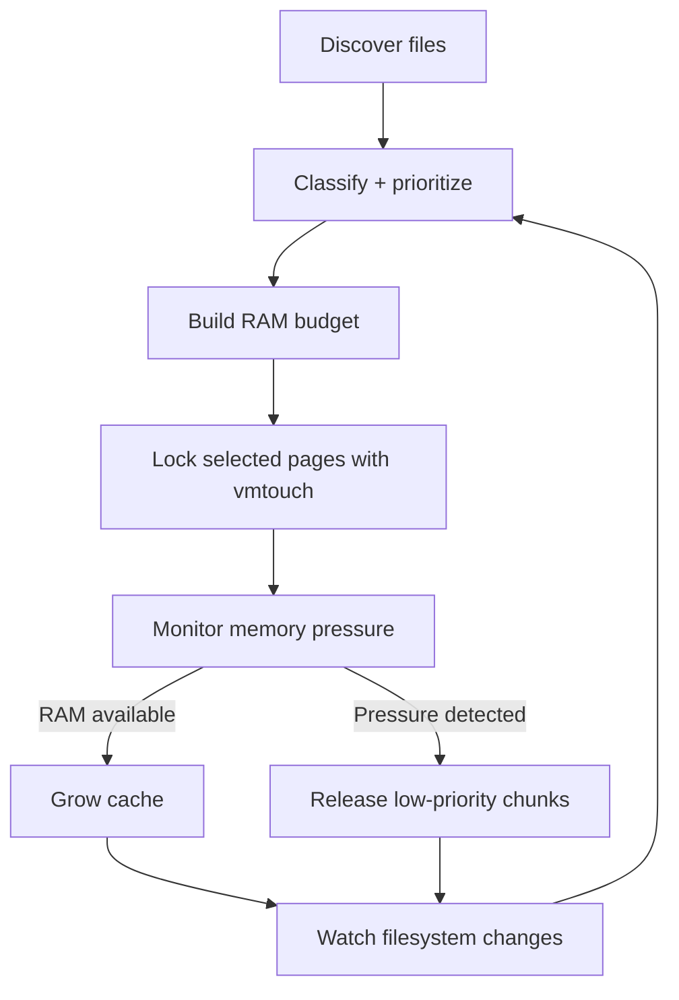
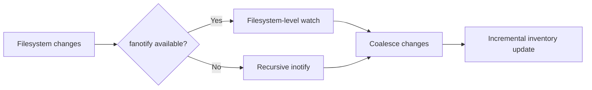

<div align="center">

# ◈ RAMCACHE

### An adaptive, preemptive RAM cache controller for Linux.

**Faster launches · Smarter page caching · Automatic memory-pressure response**

<br>


<br><br>

**RAMCache turns otherwise idle memory into a prioritized, self-adjusting cache for the files that make Linux applications feel fast.**

It preloads useful files into the normal Linux page cache, locks selected pages with `vmtouch`, and automatically gives RAM back when applications need it.

**No tmpfs. No file copies. No filesystem replacement.**

<br>

[Install](#-install) ·
[Status](#-status) ·
[Uninstall](#-uninstall) ·
[How it works](#how-it-works) ·
[Memory control](#memory-control) ·
[Configuration](#configuration)

</div>

---

# Quick start

## ⚡ Install

```bash
curl -fsSL https://raw.githubusercontent.com/MagnetosphereLabs/RamCache/main/ramcache.sh | sudo bash -s install
```

This downloads the current `ramcache.sh` from GitHub and runs its `install` action as root.

The installer:

1. Checks for `python3`, `vmtouch`, and `inotify-tools`.
2. Installs missing dependencies with `apt`.
3. Checks whether fanotify filesystem watching is available.
4. Installs the controller under `/opt/ramcache-controller`.
5. Writes the default configuration under `/etc/ramcache-controller`.
6. Creates the systemd service.
7. Installs RAM-cache and filesystem-watcher sysctl settings.
8. Reloads systemd.
9. Enables RAMCache at boot.
10. Starts — or restarts — the controller immediately.

> [!IMPORTANT]
> Running the install command again acts as a reinstall/update and writes the current default `config.json` again. Back up custom configuration before reinstalling.

---

## ◇ Status

```bash
curl -fsSL https://raw.githubusercontent.com/MagnetosphereLabs/RamCache/main/ramcache.sh | bash -s status
```

This does **not install or modify RAMCache**.

It prints:

* RAMCache version
* Linux distribution and kernel
* systemd service state
* Controller status JSON
* Available, cached, mlocked, and unevictable memory
* VM cache tuning
* Filesystem-watcher support
* Active watcher mode
* fanotify capability information

For the privileged fanotify runtime test, run the same command through `sudo`:

```bash
curl -fsSL https://raw.githubusercontent.com/MagnetosphereLabs/RamCache/main/ramcache.sh | sudo bash -s status
```

Useful local checks after installation:

```bash
systemctl status ramcache-controller.service --no-pager
```

```bash
python3 -m json.tool /run/ramcache-controller/status.json
```

```bash
journalctl -u ramcache-controller.service -f
```

---

## ✕ Uninstall

```bash
curl -fsSL https://raw.githubusercontent.com/MagnetosphereLabs/RamCache/main/ramcache.sh | sudo bash -s uninstall
```

This downloads the current script and runs its `uninstall` action as root.

It:

* Stops RAMCache.
* Kills remaining processes belonging to the service.
* Disables the service.
* Removes the systemd unit.
* Removes the controller.
* Removes RAMCache configuration.
* Removes runtime state.
* Removes RAMCache-owned sysctl configuration files.
* Removes the old legacy cache sysctl file **only if its contents match the file created by an older RAMCache release**.
* Reloads systemd.

It does **not** uninstall `python3`, `vmtouch`, or `inotify-tools`.

> [!NOTE]
> Removing a sysctl configuration file does not necessarily restore an already-applied kernel value immediately. Those live values may remain until changed manually or the system is rebooted.

---

# What is RAMCache?

RAMCache is a systemd-managed Linux controller that proactively keeps useful file-backed data resident in RAM.

Linux already uses unused memory as a filesystem cache. That behavior is excellent, but mostly reactive:

```text
Application requests file
        ↓
Storage is accessed
        ↓
Linux keeps the data in page cache
        ↓
Later reads may be faster
```

RAMCache adds a proactive layer:

```text
System starts
      ↓
Useful files are discovered
      ↓
Files are ranked by value
      ↓
Selected pages are loaded + locked in RAM
      ↓
Applications can hit memory immediately
```

The goal is to reduce storage waits during workloads made up of many small reads:

* Application launches
* Shared-library loading
* Desktop startup
* Browser startup
* Steam startup
* Proton/Wine initialization
* Shader-cache access
* Fonts, icons, MIME data, and desktop metadata
* Electron and Flatpak application startup

Even very fast NVMe drives are slower than RAM when software needs thousands of scattered files and metadata records.

---

# This is not a RAM disk

RAMCache does **not** copy your applications into `tmpfs`.

It does not move files or change where applications read their data.



The original files remain on their normal filesystem.

RAMCache uses Linux's existing **file-backed page cache** and `vmtouch -l` to keep selected pages resident until the controller decides that memory should be released.

---

# How it works

RAMCache continuously coordinates four jobs:



### 1. Discover

The controller scans configured filesystems and automatically discovers common Linux application locations.

It understands paths associated with:

* Core Linux binaries and libraries
* Desktop environments
* Flatpak
* Snap
* Steam libraries
* Proton and Wine
* Browsers
* Electron applications
* Shader caches
* VR runtimes
* User application state

Steam libraries can also be discovered from `libraryfolders.vdf`.

### 2. Rank

Files are not treated equally.

High-value executable and runtime data is placed ahead of generic fallback files.

A simplified priority model looks like this:

| Priority     | Typical data                                                               |
| ------------ | -------------------------------------------------------------------------- |
| **Highest**  | Core libraries, executables, linker data, selected high-value applications |
| **High**     | Steam client, Proton/Wine, VR runtimes, installed application code         |
| **Medium**   | Browser/application startup state and bounded high-value caches            |
| **Support**  | Fonts, icons, MIME data, desktop metadata, schemas                         |
| **Fallback** | Other safe files, generally favoring smaller files                         |

Huge media, archives, package images, logs, container storage, source trees, browser bulk caches, and other low-value data are excluded or heavily deprioritized.

RAMCache also contains targeted policies for selected application and game workloads rather than blindly locking every file under Steam or a user's home directory.

### 3. Select

The controller calculates how much memory can safely be used and walks the priority-ordered inventory until that budget is filled.

### 4. Lock

Selected files are passed to:

```text
vmtouch -q -l -0 -b - -m <maximum-file-size>
```

`vmtouch` loads those file-backed pages and keeps them resident using `mlock()`.

The cache is divided into smaller worker chunks so lower-priority memory can be released without tearing down the entire cache.

---

# Memory control

The most important part of RAMCache is not filling RAM.

It is **giving RAM back quickly when something else needs it**.

RAMCache watches three independent pressure signals.

### MemAvailable

The normal profile uses these default watermarks:

```text
MemAvailable < 4 GiB
        │
        └── SHRINK immediately toward 6 GiB available

4 GiB ─────────────── 7 GiB
        HOLD

MemAvailable > 7 GiB
        │
        └── GROW while targeting ~6 GiB available
```

That gap creates hysteresis so the controller does not constantly grow and shrink around one threshold.

### Rapid application memory growth

RAMCache separately monitors memory consumption every **0.5 seconds**.

It can react before the hard available-memory floor is reached when another workload suddenly begins allocating large amounts of RAM.

The controller tracks both short and longer memory-growth windows, predicts near-term demand, and can proactively release cache.

### Linux PSI

Linux **Pressure Stall Information** provides another signal.

If the kernel reports meaningful memory stalls, RAMCache can release locked cache even when a simple free-memory threshold has not yet told the whole story.

After a pressure event, a short regrowth guard prevents the controller from immediately fighting the application for the memory it just released.

---

## Fast shrink

Normal RAMCache chunks are approximately:

```text
1 GiB per vmtouch chunk
```

When pressure appears, tail chunks are stopped first.

Because the selected list is priority ordered, this tends to preserve the highest-value cache entries while releasing lower-priority RAM.

Multiple chunks can be signaled concurrently for fast release.

---

# Designed not to fight the desktop

RAMCache intentionally runs as background infrastructure rather than foreground work.

The generated systemd service uses:

```text
Nice=19
IOSchedulingClass=idle
```

It also:

* Restricts execution to roughly half of the machine's logical CPUs.
* Prefers one SMT sibling from each physical core first.
* Limits aggregate controller CPU time to approximately **25% of the whole machine**.
* Uses storage-aware scan concurrency.
* Keeps rotational-drive scanning substantially more conservative than SSD/NVMe scanning.

Metadata scanning may use many threads on fast storage because those threads spend much of their time waiting on filesystem operations, while the systemd CPU quota still limits actual CPU consumption.

---

# Filesystem watching

RAMCache does not repeatedly rescan the entire computer every few seconds.

It prefers a filesystem-level **fanotify** watcher when the installed tools and kernel support it.

If that cannot be used, it automatically falls back to recursive **inotify**.



Normal filesystem activity is coalesced and processed in batches rather than immediately triggering expensive work.

If the watcher dies, overflows, or loses synchronization, RAMCache requests an authoritative recovery scan instead of silently trusting stale information.

---

# Low-RAM systems

RAMCache automatically enables a separate low-memory profile when total system RAM is below:

```text
20 GiB
```

The low-RAM profile is more conservative about individual file sizes, cache budgets, scanner concurrency, and chunk size.

For example, normal cache chunks are approximately `1 GiB`, while the low-RAM profile uses approximately `512 MiB` chunks so memory can be released more surgically.

The active profile is visible in the status output:

```json
"memory_profile": "normal"
```

or:

```json
"memory_profile": "low_ram"
```

---

# Status data

Runtime status is written to:

```text
/run/ramcache-controller/status.json
```

Important fields include:

| Field                     | Meaning                                      |
| ------------------------- | -------------------------------------------- |
| `controller_version`      | Running controller version                   |
| `memory_profile`          | `normal` or `low_ram`                        |
| `target_locked_gib`       | Current controller lock target               |
| `selected_files`          | Number of selected cache files               |
| `selected_gib`            | Approximate selected cache size              |
| `inventory_files`         | Files currently known to the controller      |
| `memavailable_gib`        | Linux `MemAvailable`                         |
| `mlocked_gib`             | Memory currently reported as mlocked         |
| `rapid_memory_growth_gib` | Recently detected memory growth              |
| `psi_memory_*`            | Recent PSI memory-stall signals              |
| `watcher_mode`            | Active filesystem watcher                    |
| `scan_workers`            | Current scanner worker count                 |
| `scan_storage_profile`    | Rotational, nonrotational, mixed, or unknown |

Pretty-print it at any time:

```bash
python3 -m json.tool /run/ramcache-controller/status.json
```

---

# Configuration

Configuration lives at:

```text
/etc/ramcache-controller/config.json
```

The most useful settings are:

| Setting                               | Default | Purpose                                 |
| ------------------------------------- | ------: | --------------------------------------- |
| `target_available_bytes`              |    `4G` | Hard available-memory floor             |
| `target_shrink_to_available_bytes`    |    `6G` | Desired reserve after shrinking         |
| `target_grow_above_available_bytes`   |    `7G` | Available RAM required before growing   |
| `target_grow_to_available_bytes`      |    `6G` | Reserve RAM while growing               |
| `target_initial_max_bytes`            |    `8G` | Initial cache target cap                |
| `target_max_grow_step_bytes`          |    `8G` | Maximum growth step                     |
| `vmtouch_chunk_target_bytes`          | `1024M` | Normal cache chunk target               |
| `vmtouch_max_file_size`               |  `128G` | Maximum candidate file size             |
| `incremental_rescan_interval_seconds` |   `600` | Filesystem-change batching interval     |
| `low_ram_total_threshold_bytes`       |   `20G` | Threshold for automatic low-RAM profile |

Size fields accept values such as:

```text
512M
4G
20G
1T
```

After changing configuration, restarting the service applies it immediately:

```bash
sudo systemctl restart ramcache-controller.service
```

---

# Installed files

RAMCache creates:

```text
/opt/ramcache-controller/ramcache_controller.py
/etc/ramcache-controller/config.json
/etc/systemd/system/ramcache-controller.service
/etc/sysctl.d/99-ramcache-inotify.conf
/etc/sysctl.d/99-ramcache-vm.conf
```

Runtime state lives under:

```text
/run/ramcache-controller/
```

The installer configures additional inotify capacity for large directory trees and sets:

```text
vm.vfs_cache_pressure=10
```

If the running kernel exposes `vm.vfs_cache_pressure_denom`, RAMCache configures the matching denominator as well. Unsupported kernel settings are skipped rather than written blindly.

---

# Requirements

The current installer targets Debian/Ubuntu-family distributions using `apt`, including systems such as:

* Ubuntu
* Pop!_OS
* Linux Mint
* Debian-family derivatives with systemd

Required software:

```text
python3
vmtouch
inotify-tools
systemd
```

Missing package dependencies are installed automatically during installation.

---

# What RAMCache can improve

RAMCache is aimed primarily at **storage-sensitive interactive workloads**.

Potential benefits include:

* Faster application cold starts
* Faster repeated application launches
* Faster access to shared libraries and runtime files
* More responsive desktop metadata, fonts, and icons
* Faster Steam client and selected Proton/Wine startup paths
* Reduced cold-cache behavior after unrelated heavy I/O
* Better use of otherwise idle RAM on high-memory systems

Results depend on the workload and storage device.

RAMCache does not make CPU-bound calculations, GPU rendering, or network latency intrinsically faster.

---

# Safety model

RAMCache is deliberately designed around reclaimability and low interference.

It:

* Does not modify cached files.
* Does not move application data.
* Does not create a duplicate RAM filesystem.
* Does not replace application directories with tmpfs.
* Does not follow symlinks while scanning.
* Avoids special filesystems and unsafe temporary paths.
* Avoids crossing filesystem boundaries by default.
* Skips non-regular and empty files.
* Excludes known low-value or dangerous directory trees.
* Caps and prioritizes selected application caches.
* Continuously monitors system memory.
* Aborts expensive scan work when memory pressure appears.
* Releases lower-priority locked chunks first.
* Stops all `vmtouch` workers when the service exits.

The cache exists to use **spare RAM**.

Applications remain the priority.

---

# Why use this instead of normal Linux caching?

Linux's page cache is already very good.

RAMCache does not replace it.

It changes **which data gets there first and which data is allowed to remain there**.

```text
Normal Linux
────────────
Read → Cache → Possibly reclaim

RAMCache
────────
Predict → Preload → Prioritize → Lock
                       ↓
                Memory pressure?
                  ↙         ↘
               no             yes
               ↓               ↓
             grow            release
```

If the system has large amounts of otherwise unused memory, RAMCache gives that memory a specific job: keep high-value application and runtime data immediately accessible while retaining the ability to surrender that RAM when real workloads demand it.

---

<div align="center">

## ◈ Make idle RAM useful.

**Adaptive · Prioritized · Pressure-aware · Native Linux page cache**

<br>

RAMCache does not replace Linux caching.

### It gives it a head start.

</div>
